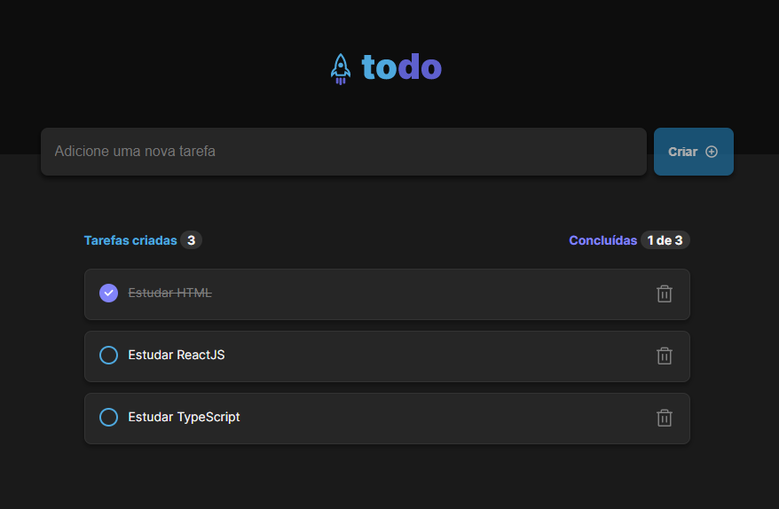

<h1 align="center">
  ToDo List 📋
</h1>

<p align="center">
  <a href="#-sobre-o-projeto">Projeto</a>&nbsp;&nbsp;&nbsp;|&nbsp;&nbsp;&nbsp;
  <a href="#-conceitos-utilizados-no-desenvolvimento">Conceitos</a>&nbsp;&nbsp;&nbsp;|&nbsp;&nbsp;&nbsp;
  <a href="#-tecnologias-utilizadas">Tecnologias</a>&nbsp;&nbsp;&nbsp;|&nbsp;&nbsp;&nbsp;
  <a href="#-como-executar-o-projeto">Executar o projeto</a>&nbsp;&nbsp;&nbsp;|&nbsp;&nbsp;&nbsp;
  <a href="#-licença">Licença</a>
</p>

# 🚧 Sobre o projeto

Preview: https://todo-list-joaosam.vercel.app/

Primeiro desafio da trilha de ReactJS do Ignite.

Aplicação de controle de tarefas no estilo **todo list**.
Layout disponibilizado no Figma [Layout](<https://www.figma.com/file/lmpOULoPakf24H7vO98EaU/ToDo-List-(Copy)?node-id=0%3A1> "Layout no Figma").

## 🛠️ Funcionalidades

- Adicionar uma nova tarefa
- Marcar e desmarcar uma tarefa como concluída
- Remover uma tarefa da listagem
- Mostrar o progresso de conclusão das tarefas

# 📚 Conceitos Utilizados no Desenvolvimento

- Estados
- Imutabilidade do estado
- Listas e chaves no ReactJS
- Propriedades
- Componentização
- Local Storage (Extra)

## 🎨 Layout



# 🚀 Tecnologias utilizadas

- CSS Modules
- ReactJS
- TypeScript

# 💻 Como executar o projeto

Pré-requisitos: npm / yarn

```bash
# Clonar repositório
git clone https://github.com/Joaosam/todo-list.git

# Navegar até a pasta
cd todo-list

# Instalar dependências
npm install

# Executar o projeto
npm run dev
```

## 📝 Licença

Esse projeto está sob a licença MIT. Veja o arquivo [LICENSE](LICENSE) para mais detalhes.
[](https://github.com/Joaosam/todo-list/blob/master/LICENSE)

<br />

---

Feito com ♥ by Joaosam
